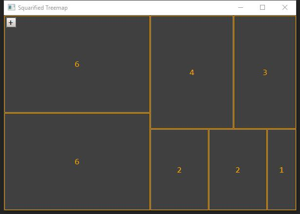
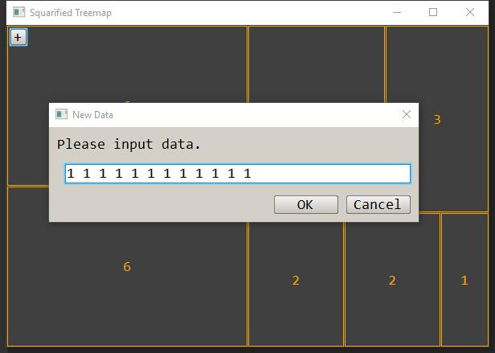
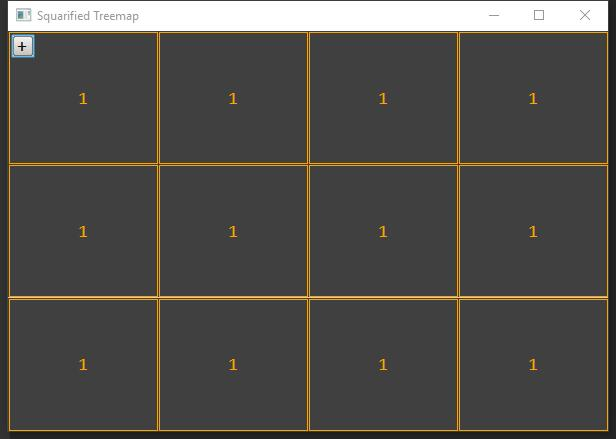

# Squarified Treemap implementation in c++

## Theory and Tools

[*Treemaps for space - constrained visualization of hierarchies*](http://www.cs.umd.edu/hcil/treemap-history/index.shtml)

[*Squarified Treemaps*](https://www.win.tue.nl/~vanwijk/stm.pdf) - Mark Bruls, Kees Huizing, and Jarke J. van Wijk

[Nana](http://nanapro.org) - A cross-platform library for GUI programming in modern C++ style

[Vcpkg](https://github.com/microsoft/vcpkg) - C++ Library Manager for Windows, Linux, and MacOS

[CMake](https://cmake.org/) - An open-source, cross-platform family of tools designed to build, test and package software.

## Show

